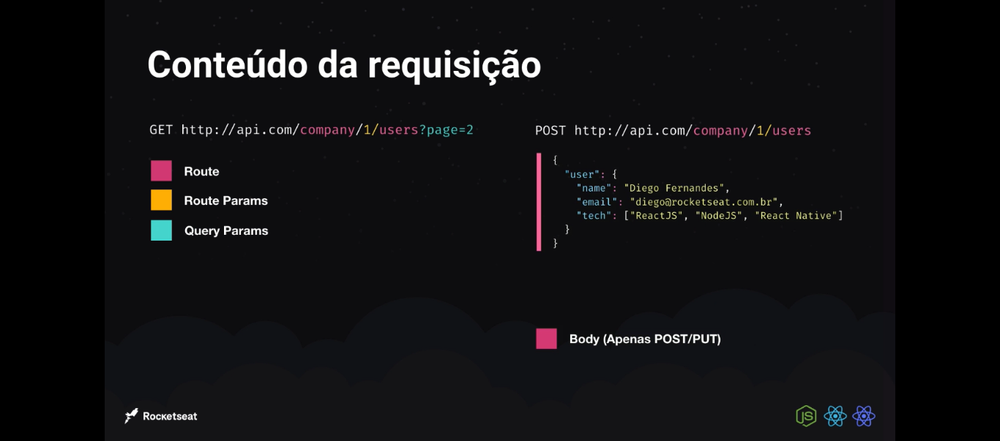

# REST

## Como Funciona?

* Fluxo de requisição e resposta
  * Requisição feita por um cliente (Browser)
  * Resposta retornada através de uma estrutura de dados (json)
  * Cliente recebe a resposta e processa o resultado (react, react-native, vuejs, etc)
  
* As rotas ultilizando o metodo HTTP
  * GET => http://minhaapi.com/users => quando quero listar... 
  * POST => http://minhaapi.com/users => Quando eu quero criar...
  * PUT => http://minhaapi.com/users/1 => Quando eu quero editar...
  * DELETE => http://minhaapi.com/users/1 => Quando eu quero deletar...

## Beneficios
* Multiplos clientes(front-end), com mesmo back-end
* Protocolo de comunicação padronizado
  * Mesma estrutura para web/mobile/api-publica
  * Comunicação com serviçoes esternos

# Conteúdo da requisiçao

  